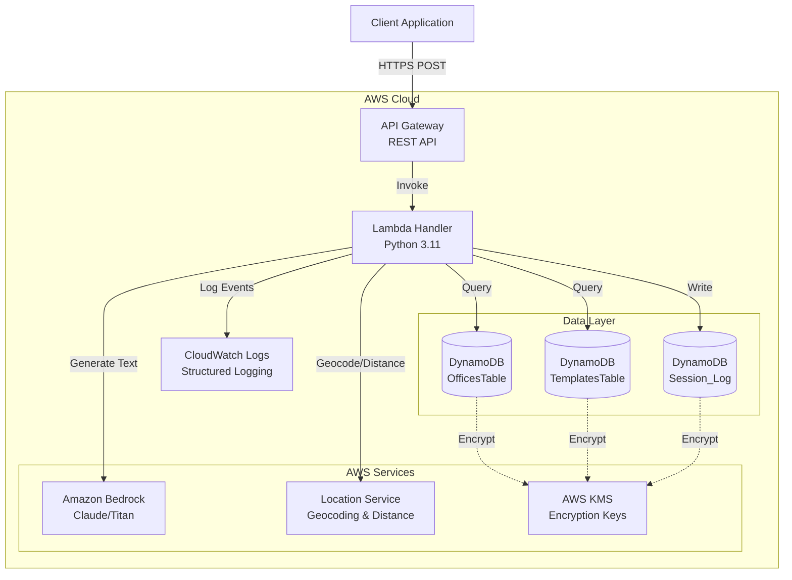
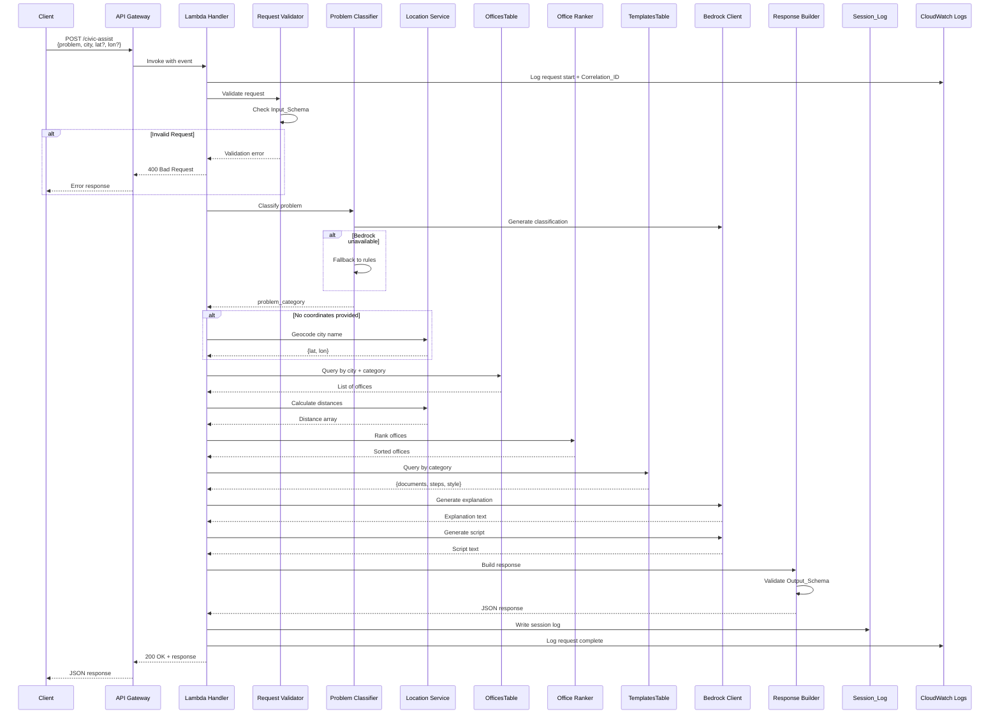

# Technical Design Document: Kiro Backend Civic Assistant

## Overview

The Kiro Backend is a serverless AWS-based civic assistance system that helps users identify appropriate government offices for their needs and provides actionable guidance. The system accepts user problem descriptions with location data, classifies the problem, ranks relevant offices by proximity, and generates personalized recommendations including required documents and conversation scripts.

### Key Design Principles

- **Serverless Architecture**: Built entirely on AWS managed services (API Gateway, Lambda, DynamoDB, Bedrock, Location Service)
- **Privacy-First**: Minimal PII storage with only session metadata persisted
- **Resilient**: Graceful degradation when AI services are unavailable
- **Observable**: Structured logging with correlation IDs for full request tracing
- **Secure**: KMS encryption at rest, IAM least-privilege access, input validation
- **Testable**: Comprehensive unit and contract test coverage

### System Boundaries

**In Scope:**
- Request validation and response formatting
- Problem classification and office matching
- Distance calculation and office ranking
- AI-generated explanations and scripts via Bedrock
- Session logging with minimal data retention
- Error handling and fallback mechanisms

**Out of Scope:**
- User authentication and authorization
- Office data management UI
- Real-time office availability checking
- Multi-language support
- Payment processing

## Architecture

### High-Level Architecture Diagram



### Request Flow Sequence Diagram



## Components and Interfaces

### Request_Validator

**Purpose**: Validates incoming requests against the Input_Schema and parses them into structured objects.

**Interface**:
```python
class RequestValidator:
    def validate(self, event: dict) -> ValidationResult:
        """
        Validates API Gateway event against Input_Schema.
        
        Args:
            event: API Gateway event dictionary
            
        Returns:
            ValidationResult with parsed data or error details
            
        Raises:
            ValidationError: When schema validation fails
        """
        pass
```

**Responsibilities**:
- Parse JSON body from API Gateway event
- Validate required fields (problem, city)
- Validate optional fields (latitude, longitude) with range checks
- Return structured error messages for validation failures
- Extract and validate correlation_id from headers

**Dependencies**:
- jsonschema library for schema validation
- Input_Schema definition

**Error Handling**:
- Missing required fields → 400 with field list
- Invalid coordinate ranges → 400 with range specification
- Malformed JSON → 400 with parse error details

### Problem_Classifier

**Purpose**: Categorizes user problem descriptions into predefined categories for office and template matching.

**Interface**:
```python
class ProblemClassifier:
    def classify(self, problem_description: str, correlation_id: str) -> str:
        """
        Classifies problem into category.
        
        Args:
            problem_description: User's problem text
            correlation_id: Request tracing ID
            
        Returns:
            Category string (e.g., "permits", "licenses", "taxes")
        """
        pass
```

**Responsibilities**:
- Primary: Use Bedrock for AI-based classification
- Fallback: Rule-based keyword matching when Bedrock unavailable
- Return exactly one category per request
- Default to "general" category when confidence is low
- Log classification decisions with correlation_id

**Categories**:
- permits
- licenses
- taxes
- vital_records
- property
- business
- health
- transportation
- general (default)

**Bedrock Integration**:
- Model: Claude 3 Haiku (fast, cost-effective)
- Prompt: "Classify this civic problem into one category: {categories}. Problem: {description}. Return only the category name."
- Timeout: 5 seconds
- Fallback on timeout or error

**Rule-Based Fallback**:
- Keyword matching with predefined patterns
- Example: "building permit" → permits, "driver license" → licenses

### Office_Ranker

**Purpose**: Ranks offices by distance and relevance to provide ordered recommendations.

**Interface**:
```python
class OfficeRanker:
    def rank(self, offices: List[Office], distances: List[float], 
             category: str) -> RankedOffices:
        """
        Ranks offices by distance and relevance.
        
        Args:
            offices: List of office objects from DynamoDB
            distances: Parallel array of distances in km
            category: Classified problem category
            
        Returns:
            RankedOffices with primary and alternatives
        """
        pass
```

**Responsibilities**:
- Sort offices by distance (nearest first)
- Apply category relevance boost (offices matching category ranked higher)
- Select nearest office as primary recommendation
- Select next 3 nearest as alternatives
- Handle cases with fewer than 4 offices
- Handle missing distance data (rank by relevance only)

**Ranking Algorithm**:
1. Calculate score: `score = -distance + (category_match ? 10 : 0)`
2. Sort by score descending
3. Select top 4 offices
4. Designate first as primary, rest as alternatives

### Bedrock_Client

**Purpose**: Interfaces with Amazon Bedrock for AI-generated explanations and conversation scripts.

**Interface**:
```python
class BedrockClient:
    def generate_explanation(self, office: Office, category: str, 
                            correlation_id: str) -> str:
        """
        Generates explanation for office recommendation.
        
        Args:
            office: Recommended office object
            category: Problem category
            correlation_id: Request tracing ID
            
        Returns:
            Bullet-point explanation text
        """
        pass
    
    def generate_script(self, category: str, template_style: str,
                       correlation_id: str) -> ConversationScript:
        """
        Generates conversation script for office visit.
        
        Args:
            category: Problem category
            template_style: Style from template (formal/casual)
            correlation_id: Request tracing ID
            
        Returns:
            ConversationScript with opening and follow-ups
        """
        pass
```

**Responsibilities**:
- Generate office recommendation explanations
- Generate conversation scripts with opening and follow-ups
- Apply guardrails preventing legal guarantees
- Include "verify at counter" language
- Handle timeouts and errors gracefully
- Return default content on failure
- Log all Bedrock interactions with correlation_id

**Guardrails**:
- No promises of specific outcomes
- No legal advice or guarantees
- Always include verification language
- Factual, helpful tone

**Default Content**:
- Explanation: "This office handles {category} matters in your area. Please verify services at the counter."
- Script: "Hello, I need help with {category}. Can you direct me to the right department?"

### Location_Service Integration

**Purpose**: Provides geocoding and distance calculation using Amazon Location Service.

**Interface**:
```python
class LocationService:
    def geocode_city(self, city_name: str, correlation_id: str) -> Coordinates:
        """
        Geocodes city name to coordinates.
        
        Args:
            city_name: City name string
            correlation_id: Request tracing ID
            
        Returns:
            Coordinates with lat/lon
            
        Raises:
            GeocodingError: When city not found
        """
        pass
    
    def calculate_distances(self, origin: Coordinates, 
                           destinations: List[Coordinates],
                           correlation_id: str) -> List[float]:
        """
        Calculates distances from origin to destinations.
        
        Args:
            origin: User coordinates
            destinations: Office coordinates
            correlation_id: Request tracing ID
            
        Returns:
            List of distances in kilometers
        """
        pass
```

**Responsibilities**:
- Geocode city names to lat/lon coordinates
- Calculate distances between coordinates
- Return distances in kilometers
- Handle geocoding failures with descriptive errors
- Handle distance calculation failures gracefully
- Log all Location Service calls with correlation_id

**Error Handling**:
- City not found → Return error with suggestions
- Service unavailable → Allow ranking without distances
- Invalid coordinates → Validate before calling service

### Response_Builder

**Purpose**: Constructs JSON responses conforming to Output_Schema.

**Interface**:
```python
class ResponseBuilder:
    def build_success_response(self, primary_office: Office, 
                              alternatives: List[Office],
                              checklist: Checklist,
                              script: ConversationScript,
                              bedrock_used: bool) -> dict:
        """
        Builds successful response.
        
        Args:
            primary_office: Recommended office with distance
            alternatives: Alternative offices
            checklist: Documents and steps
            script: Conversation script
            bedrock_used: Whether Bedrock generated content
            
        Returns:
            Response dict conforming to Output_Schema
        """
        pass
    
    def build_error_response(self, error_type: str, 
                            message: str, 
                            correlation_id: str) -> dict:
        """
        Builds error response.
        
        Args:
            error_type: Error category
            message: Error description
            correlation_id: Request tracing ID
            
        Returns:
            Error response dict
        """
        pass
```

**Responsibilities**:
- Construct response objects matching Output_Schema
- Include all required fields
- Add privacy information block
- Validate response against schema before returning
- Format distances with units
- Include metadata (bedrock_used, correlation_id)

**Privacy Block**:
```json
{
  "privacy": {
    "stored": ["session_id", "problem_category", "city", "timestamp"],
    "not_stored": ["problem_description", "coordinates", "personal_details"]
  }
}
```

## Data Models

### DynamoDB Tables

#### OfficesTable

**Purpose**: Stores government office directory information.

**Schema**:
```python
{
  "office_id": "string",           # Partition key (UUID)
  "city": "string",                # GSI partition key
  "office_type": "string",         # e.g., "city_hall", "dmv", "tax_office"
  "name": "string",                # Official office name
  "address": "string",             # Full street address
  "latitude": "number",            # Decimal degrees
  "longitude": "number",           # Decimal degrees
  "category_tags": ["string"],     # e.g., ["permits", "licenses"]
  "hours": "string",               # Optional, e.g., "Mon-Fri 9am-5pm"
  "phone": "string",               # Optional contact number
  "created_at": "string",          # ISO 8601 timestamp
  "updated_at": "string"           # ISO 8601 timestamp
}
```

**Indexes**:
- Primary: `office_id` (partition key)
- GSI: `city-index` with `city` as partition key

**Access Patterns**:
- Query offices by city and category tags
- Query all offices in a city (fallback)

**Encryption**: KMS encryption at rest

#### TemplatesTable

**Purpose**: Stores checklist and script templates by problem category.

**Schema**:
```python
{
  "category": "string",            # Partition key
  "documents": ["string"],         # Required documents list
  "steps": ["string"],             # Preparation steps list
  "script_style": "string",        # "formal" or "casual"
  "notes": "string",               # Optional additional guidance
  "created_at": "string",          # ISO 8601 timestamp
  "updated_at": "string"           # ISO 8601 timestamp
}
```

**Indexes**:
- Primary: `category` (partition key)

**Access Patterns**:
- Get template by category

**Encryption**: KMS encryption at rest

**Default Template** (when category not found):
```python
{
  "category": "general",
  "documents": ["Government-issued ID", "Proof of address"],
  "steps": [
    "Bring all relevant documents",
    "Arrive during business hours",
    "Be prepared to explain your situation"
  ],
  "script_style": "formal"
}
```

#### Session_Log

**Purpose**: Stores minimal session metadata for analytics and debugging.

**Schema**:
```python
{
  "session_id": "string",          # Partition key (UUID)
  "correlation_id": "string",      # Request correlation ID
  "problem_category": "string",    # Classified category
  "city": "string",                # City name only (no coordinates)
  "timestamp": "string",           # ISO 8601 timestamp
  "bedrock_used": "boolean",       # Whether Bedrock was available
  "processing_duration_ms": "number"  # Request processing time
}
```

**Indexes**:
- Primary: `session_id` (partition key)
- GSI: `timestamp-index` for time-based queries

**Access Patterns**:
- Write session log at request completion
- Query sessions by timestamp for analytics

**Encryption**: KMS encryption at rest

**PII Constraints**:
- NO problem descriptions
- NO coordinates (only city name)
- NO user identifiers beyond session_id
- NO document or personal details

## JSON Schemas

### Input_Schema

```json
{
  "$schema": "http://json-schema.org/draft-07/schema#",
  "type": "object",
  "required": ["problem", "city"],
  "properties": {
    "problem": {
      "type": "string",
      "minLength": 10,
      "maxLength": 1000,
      "description": "User's civic problem description"
    },
    "city": {
      "type": "string",
      "minLength": 2,
      "maxLength": 100,
      "description": "City name for office search"
    },
    "latitude": {
      "type": "number",
      "minimum": -90,
      "maximum": 90,
      "description": "Optional latitude in decimal degrees"
    },
    "longitude": {
      "type": "number",
      "minimum": -180,
      "maximum": 180,
      "description": "Optional longitude in decimal degrees"
    }
  },
  "additionalProperties": false
}
```

### Output_Schema

```json
{
  "$schema": "http://json-schema.org/draft-07/schema#",
  "type": "object",
  "required": ["recommended_office", "alternatives", "checklist", "conversation_script", "privacy", "metadata"],
  "properties": {
    "recommended_office": {
      "type": "object",
      "required": ["name", "address", "distance_km", "explanation"],
      "properties": {
        "name": {"type": "string"},
        "address": {"type": "string"},
        "distance_km": {"type": "number"},
        "phone": {"type": "string"},
        "hours": {"type": "string"},
        "explanation": {"type": "string"}
      }
    },
    "alternatives": {
      "type": "array",
      "items": {
        "type": "object",
        "required": ["name", "address", "distance_km"],
        "properties": {
          "name": {"type": "string"},
          "address": {"type": "string"},
          "distance_km": {"type": "number"},
          "phone": {"type": "string"},
          "hours": {"type": "string"}
        }
      }
    },
    "checklist": {
      "type": "object",
      "required": ["documents", "steps"],
      "properties": {
        "documents": {
          "type": "array",
          "items": {"type": "string"}
        },
        "steps": {
          "type": "array",
          "items": {"type": "string"}
        }
      }
    },
    "conversation_script": {
      "type": "object",
      "required": ["opening", "follow_ups"],
      "properties": {
        "opening": {"type": "string"},
        "follow_ups": {
          "type": "array",
          "items": {"type": "string"}
        }
      }
    },
    "privacy": {
      "type": "object",
      "required": ["stored", "not_stored"],
      "properties": {
        "stored": {
          "type": "array",
          "items": {"type": "string"}
        },
        "not_stored": {
          "type": "array",
          "items": {"type": "string"}
        }
      }
    },
    "metadata": {
      "type": "object",
      "required": ["correlation_id", "bedrock_used"],
      "properties": {
        "correlation_id": {"type": "string"},
        "bedrock_used": {"type": "boolean"},
        "processing_time_ms": {"type": "number"}
      }
    }
  }
}
```


## Correctness Properties

*A property is a characteristic or behavior that should hold true across all valid executions of a system-essentially, a formal statement about what the system should do. Properties serve as the bridge between human-readable specifications and machine-verifiable correctness guarantees.*

### Property 1: Valid Request Acceptance

*For any* JSON request containing a problem description (10-1000 chars), city name (2-100 chars), and optionally valid coordinates (lat: -90 to 90, lon: -180 to 180), the Request_Validator should accept and parse the request successfully.

**Validates: Requirements 1.1**

### Property 2: Invalid Request Rejection with Descriptive Errors

*For any* JSON request that fails Input_Schema validation (missing required fields, invalid types, out-of-range values), the Request_Validator should return a descriptive error message identifying the specific validation failure.

**Validates: Requirements 1.4, 2.3, 2.4**

### Property 3: Request Serialization Round-Trip

*For any* valid request object, serializing to JSON, then parsing, then serializing again should produce equivalent JSON output.

**Validates: Requirements 2.6**

### Property 4: Correlation ID in All Logs

*For any* request processed by the Lambda_Handler, all CloudWatch log entries for that request should contain the same Correlation_ID value.

**Validates: Requirements 1.6, 13.2**

### Property 5: City Geocoding Returns Coordinates

*For any* valid city name, when the Location_Service geocodes it successfully, the result should contain latitude and longitude values within valid ranges (lat: -90 to 90, lon: -180 to 180).

**Validates: Requirements 3.1**

### Property 6: Direct Coordinates Bypass Geocoding

*For any* request containing both city name and coordinates, the Lambda_Handler should use the provided coordinates without invoking Location_Service geocoding.

**Validates: Requirements 3.4**

### Property 7: Problem Classification Returns Valid Category

*For any* problem description, the Problem_Classifier should return exactly one category from the predefined set (permits, licenses, taxes, vital_records, property, business, health, transportation, general).

**Validates: Requirements 4.1, 4.4**

### Property 8: Classification Fallback on Bedrock Failure

*For any* problem description, when Bedrock is unavailable or returns an error, the Problem_Classifier should still return a valid category using rule-based fallback logic.

**Validates: Requirements 4.3**

### Property 9: Office Query Uses Correct Parameters

*For any* classified problem with category and city, the Lambda_Handler should query OfficesTable using the exact city name and category tags that match the classification.

**Validates: Requirements 5.2**

### Property 10: Office Query Returns Category Matches

*For any* city and category, when offices exist matching the category tags, the query results should include only offices that have at least one matching category tag.

**Validates: Requirements 5.3**

### Property 11: Office Query Fallback to All City Offices

*For any* city and category, when no offices match the category tags, the Lambda_Handler should retrieve all offices in the specified city regardless of category.

**Validates: Requirements 5.4**

### Property 12: Distance Calculation for All Offices

*For any* user coordinates and list of office coordinates, the Location_Service should return a distance array with the same length as the office list, with all distances as positive numbers in kilometers.

**Validates: Requirements 6.1, 6.2**

### Property 13: Office Ranking by Distance

*For any* list of offices with calculated distances, the Office_Ranker should return offices sorted by distance in ascending order (nearest first).

**Validates: Requirements 6.3**

### Property 14: Alternative Office Selection

*For any* ranked office list with 4 or more offices, the Office_Ranker should designate the first office as primary and the next three as alternatives.

**Validates: Requirements 6.5**

### Property 15: Explanation Content Requirements

*For any* office recommendation and category, the Bedrock_Client-generated explanation should be formatted as bullet points and include "verify at counter" or similar verification language.

**Validates: Requirements 7.2, 7.3, 7.5**

### Property 16: Explanation Generation

*For any* office and category, the Bedrock_Client should generate a non-empty explanation string describing why the office is appropriate.

**Validates: Requirements 7.1**

### Property 17: Template Query by Category

*For any* classified problem category, the Lambda_Handler should query TemplatesTable using that exact category value.

**Validates: Requirements 8.2**

### Property 18: Template Retrieval Returns Required Fields

*For any* valid category with an existing template, the query should return both a documents array and a steps array.

**Validates: Requirements 8.3**

### Property 19: Checklist Inclusion in Response

*For any* response built by Response_Builder, the checklist section should contain the documents array and steps array from the retrieved template.

**Validates: Requirements 8.5**

### Property 20: Conversation Script Structure

*For any* category and template style, the Bedrock_Client-generated script should include both an opening statement and a follow-ups array, with verification phrases prompting users to confirm information with office staff.

**Validates: Requirements 9.1, 9.2, 9.5**

### Property 21: Response Schema Conformance

*For any* response constructed by Response_Builder, the JSON output should validate successfully against the Output_Schema with all required fields present.

**Validates: Requirements 10.2**

### Property 22: Response Serialization Round-Trip

*For any* valid response object, serializing to JSON, then parsing, then serializing again should produce equivalent JSON output.

**Validates: Requirements 10.5**

### Property 23: Session Log PII Constraints

*For any* Session_Log record written by Lambda_Handler, it should contain only session_id, correlation_id, problem_category, city, timestamp, bedrock_used, and processing_duration_ms fields, and should NOT contain problem descriptions, coordinates (latitude/longitude), or any other PII.

**Validates: Requirements 11.1, 11.2, 11.3**

### Property 24: Privacy Block in Responses

*For any* response, the Response_Builder should include a privacy object with "stored" and "not_stored" arrays listing what data is and is not persisted.

**Validates: Requirements 11.5**

### Property 25: Encryption Failure Prevents Storage

*For any* data write operation, when KMS encryption fails, the Lambda_Handler should return an error and should not write unencrypted data to DynamoDB.

**Validates: Requirements 12.5**

### Property 26: Structured JSON Logging

*For any* request processed by Lambda_Handler, all CloudWatch log entries should be valid JSON objects containing at minimum: timestamp, correlation_id, log_level, and message fields.

**Validates: Requirements 13.1**

### Property 27: Request Timing in Logs

*For any* request, the Lambda_Handler should log entries containing request start time, end time, and processing duration in milliseconds.

**Validates: Requirements 13.3**

### Property 28: Error Logging with Stack Traces

*For any* error that occurs during request processing, the Lambda_Handler should log an error entry containing error details, stack trace, and the Correlation_ID.

**Validates: Requirements 13.4**

### Property 29: Category and City Logging Without PII

*For any* request, the Lambda_Handler should log the problem_category and city values, but should not log the problem description or any other PII.

**Validates: Requirements 13.5**

### Property 30: Bedrock Timeout Fallback

*For any* Bedrock request that times out (>5 seconds), the Bedrock_Client should return default explanation and script content without failing the overall request.

**Validates: Requirements 17.1**

### Property 31: Bedrock Error Fallback

*For any* Bedrock request that returns an error, the Bedrock_Client should log the error with Correlation_ID and return default content.

**Validates: Requirements 17.2**

### Property 32: Request Completion Despite Bedrock Failure

*For any* request, when Bedrock is unavailable or fails, the Lambda_Handler should complete the request successfully using template-based content.

**Validates: Requirements 17.3**

### Property 33: Bedrock Usage Flag in Response

*For any* response, the metadata section should include a bedrock_used boolean flag indicating whether Bedrock-generated content was used.

**Validates: Requirements 17.4**

### Property 34: Office Ranking Without Distances

*For any* office list, when Location_Service distance calculations fail or are unavailable, the Office_Ranker should rank offices by category relevance score without distance sorting.

**Validates: Requirements 18.2**

### Property 35: Request Completion Without Location Service

*For any* request, when Location_Service is unavailable, the Lambda_Handler should log the service status and attempt to complete the request without distance data.

**Validates: Requirements 18.3**

### Property 36: Distance Unavailability Indication

*For any* response where distance information is unavailable, the Response_Builder should indicate this in the response (e.g., distance_km field set to null or -1 with explanation).

**Validates: Requirements 18.4**

## Error Handling

### Error Categories

The system defines four error categories with specific HTTP status codes:

1. **Validation Errors (400 Bad Request)**
   - Missing required fields
   - Invalid field types or formats
   - Out-of-range coordinate values
   - Malformed JSON

2. **Not Found Errors (404 Not Found)**
   - City not found during geocoding
   - No offices exist for specified city

3. **Service Errors (503 Service Unavailable)**
   - Bedrock timeout or unavailable (with fallback)
   - Location Service unavailable (with fallback)
   - DynamoDB throttling or unavailable

4. **Internal Errors (500 Internal Server Error)**
   - Unexpected exceptions
   - Encryption failures
   - Schema validation failures on response

### Error Response Format

All errors return JSON responses conforming to this structure:

```json
{
  "error": {
    "type": "validation_error | not_found | service_error | internal_error",
    "message": "Human-readable error description",
    "details": {
      "field": "Specific field that failed (for validation errors)",
      "correlation_id": "Request correlation ID for tracing"
    }
  }
}
```

### Graceful Degradation Strategy

The system prioritizes availability over perfection:

**Bedrock Unavailable:**
- Classification: Fall back to rule-based keyword matching
- Explanations: Use template-based default text
- Scripts: Use template-based default scripts
- Set `bedrock_used: false` in response metadata

**Location Service Unavailable:**
- Geocoding failure: Return 404 with city suggestions
- Distance calculation failure: Rank by category relevance only
- Set distance fields to null with explanation

**DynamoDB Throttling:**
- Implement exponential backoff (3 retries)
- Return 503 if retries exhausted
- Log throttling events for capacity planning

**Template Not Found:**
- Return default template with general guidance
- Log missing category for template creation

### Logging Strategy

All errors are logged with:
- Correlation_ID for request tracing
- Error type and message
- Stack trace (for internal errors)
- Component that raised the error
- Timestamp and processing duration

Example error log entry:
```json
{
  "timestamp": "2024-01-15T10:30:45.123Z",
  "correlation_id": "abc-123-def-456",
  "log_level": "ERROR",
  "component": "BedrockClient",
  "error_type": "timeout",
  "message": "Bedrock request timed out after 5000ms",
  "fallback_used": true,
  "processing_duration_ms": 5234
}
```

## Security Design

### Encryption at Rest

**KMS Integration:**
- All DynamoDB tables use AWS KMS customer-managed keys (CMK)
- Separate CMKs for each table (OfficesTable, TemplatesTable, Session_Log)
- Key rotation enabled (automatic annual rotation)
- Key policies restrict access to Lambda execution role only

**Encryption Verification:**
- Lambda validates encryption status before writes
- Failed encryption operations prevent data storage
- Encryption failures logged with correlation_id

### IAM Roles and Policies

**Lambda Execution Role:**
```json
{
  "Version": "2012-10-17",
  "Statement": [
    {
      "Effect": "Allow",
      "Action": [
        "dynamodb:Query",
        "dynamodb:GetItem",
        "dynamodb:PutItem"
      ],
      "Resource": [
        "arn:aws:dynamodb:*:*:table/OfficesTable",
        "arn:aws:dynamodb:*:*:table/OfficesTable/index/*",
        "arn:aws:dynamodb:*:*:table/TemplatesTable",
        "arn:aws:dynamodb:*:*:table/Session_Log"
      ]
    },
    {
      "Effect": "Allow",
      "Action": [
        "bedrock:InvokeModel"
      ],
      "Resource": "arn:aws:bedrock:*:*:model/anthropic.claude-3-haiku-*"
    },
    {
      "Effect": "Allow",
      "Action": [
        "geo:SearchPlaceIndexForText",
        "geo:CalculateRoute"
      ],
      "Resource": "arn:aws:geo:*:*:place-index/CivicAssistantIndex"
    },
    {
      "Effect": "Allow",
      "Action": [
        "kms:Decrypt",
        "kms:Encrypt",
        "kms:GenerateDataKey"
      ],
      "Resource": [
        "arn:aws:kms:*:*:key/offices-table-key",
        "arn:aws:kms:*:*:key/templates-table-key",
        "arn:aws:kms:*:*:key/session-log-key"
      ]
    },
    {
      "Effect": "Allow",
      "Action": [
        "logs:CreateLogGroup",
        "logs:CreateLogStream",
        "logs:PutLogEvents"
      ],
      "Resource": "arn:aws:logs:*:*:log-group:/aws/lambda/civic-assistant-*"
    }
  ]
}
```

**Principle of Least Privilege:**
- No wildcard permissions
- Read-only access to OfficesTable and TemplatesTable
- Write access only to Session_Log
- No access to other AWS services

### PII Minimization

**Data Classification:**
- **High PII**: Problem descriptions, coordinates, medical details, document info
- **Low PII**: City name, problem category
- **No PII**: Session_id, timestamps, correlation_id

**Storage Rules:**
- High PII: Never stored, only processed in memory
- Low PII: Stored in Session_Log with encryption
- No PII: Stored in Session_Log and logs

**Request Processing:**
- Problem descriptions processed but not persisted
- Coordinates used for distance calculation then discarded
- Only aggregated, anonymized data stored

**Response Privacy Block:**
Every response includes explicit privacy information:
```json
{
  "privacy": {
    "stored": [
      "session_id",
      "problem_category",
      "city",
      "timestamp"
    ],
    "not_stored": [
      "problem_description",
      "coordinates",
      "personal_details",
      "documents"
    ]
  }
}
```

### Input Validation

**Defense in Depth:**
1. API Gateway: Request size limits (10KB max)
2. Request_Validator: Schema validation with jsonschema
3. Component-level: Type checking and sanitization
4. DynamoDB: Attribute validation on write

**Injection Prevention:**
- No SQL injection risk (DynamoDB NoSQL)
- No command injection (no shell execution)
- Bedrock prompts use parameterized templates
- All user input treated as untrusted data

### API Security

**HTTPS Only:**
- API Gateway enforces TLS 1.2+
- No HTTP endpoints exposed

**Rate Limiting:**
- API Gateway throttling: 100 requests/second per IP
- Burst limit: 200 requests

**CORS Configuration:**
- Allowed origins: Configured whitelist only
- Allowed methods: POST only
- Credentials: Not allowed

## Testing Strategy

### Dual Testing Approach

The system requires both unit tests and property-based tests for comprehensive coverage:

**Unit Tests:**
- Specific examples demonstrating correct behavior
- Edge cases (empty lists, missing data, boundary values)
- Error conditions and fallback scenarios
- Integration points between components

**Property-Based Tests:**
- Universal properties holding across all inputs
- Randomized input generation (100+ iterations per test)
- Round-trip properties for serialization
- Invariant preservation across transformations

### Property-Based Testing Configuration

**Library Selection:**
- Python: Hypothesis (recommended)
- Alternative: pytest-quickcheck

**Test Configuration:**
```python
from hypothesis import given, settings
import hypothesis.strategies as st

@settings(max_examples=100)
@given(
    problem=st.text(min_size=10, max_size=1000),
    city=st.text(min_size=2, max_size=100),
    lat=st.floats(min_value=-90, max_value=90),
    lon=st.floats(min_value=-180, max_value=180)
)
def test_property_1_valid_request_acceptance(problem, city, lat, lon):
    """
    Feature: kiro-backend, Property 1: For any JSON request containing 
    a problem description (10-1000 chars), city name (2-100 chars), 
    and optionally valid coordinates, the Request_Validator should 
    accept and parse the request successfully.
    """
    request = {"problem": problem, "city": city, "latitude": lat, "longitude": lon}
    result = RequestValidator().validate(request)
    assert result.is_valid
    assert result.parsed_data is not None
```

**Tagging Convention:**
Each property test must include a docstring comment referencing the design property:
```
Feature: kiro-backend, Property {number}: {property_text}
```

### Unit Test Coverage Requirements

**Request_Validator:**
- Valid requests with all fields
- Valid requests with optional fields omitted
- Invalid: missing required fields
- Invalid: out-of-range coordinates
- Invalid: malformed JSON
- Invalid: wrong field types

**Problem_Classifier:**
- Classification for each supported category
- Bedrock success path
- Bedrock timeout fallback
- Bedrock error fallback
- Rule-based classification
- Default "general" category

**Office_Ranker:**
- Ranking with 4+ offices
- Ranking with fewer than 4 offices
- Ranking with equal distances
- Ranking with missing distances
- Category relevance boost

**Bedrock_Client:**
- Successful explanation generation
- Successful script generation
- Timeout handling
- Error response handling
- Default content fallback
- Guardrail verification (no legal guarantees)

**Location_Service:**
- Successful geocoding
- Failed geocoding (city not found)
- Successful distance calculation
- Failed distance calculation
- Service unavailable handling

**Response_Builder:**
- Complete response with all fields
- Response with Bedrock content
- Response with default content
- Response with missing distances
- Privacy block inclusion
- Schema validation

### Contract Test Coverage

**Input Schema Validation:**
- All valid request variations
- All invalid request variations
- Field type mismatches
- Missing required fields
- Additional unexpected fields

**Output Schema Validation:**
- Successful response structure
- Error response structure
- All required fields present
- Correct field types
- Array length constraints

**Example Contract Test:**
```python
import jsonschema

def test_response_conforms_to_output_schema():
    """Contract test: Response matches Output_Schema"""
    response = build_sample_response()
    
    # Should not raise ValidationError
    jsonschema.validate(instance=response, schema=OUTPUT_SCHEMA)
    
    # Verify required fields
    assert "recommended_office" in response
    assert "alternatives" in response
    assert "checklist" in response
    assert "conversation_script" in response
    assert "privacy" in response
    assert "metadata" in response
```

### Integration Test Strategy

**DynamoDB Integration:**
- Use DynamoDB Local for testing
- Seed test data for offices and templates
- Verify query results
- Test encryption configuration

**Bedrock Integration:**
- Mock Bedrock responses in unit tests
- Use actual Bedrock in integration tests (with cost limits)
- Test timeout scenarios with delayed responses
- Verify prompt formatting

**Location Service Integration:**
- Mock Location Service in unit tests
- Use actual service in integration tests (with cost limits)
- Test geocoding for known cities
- Verify distance calculations

### Test Execution

**Local Development:**
```bash
# Run all tests
pytest tests/

# Run only unit tests
pytest tests/unit/

# Run only property tests
pytest tests/properties/

# Run with coverage
pytest --cov=src --cov-report=html tests/
```

**CI/CD Pipeline:**
1. Lint and type checking (mypy, pylint)
2. Unit tests (fast, no external dependencies)
3. Property-based tests (100 iterations each)
4. Contract tests (schema validation)
5. Integration tests (with mocked AWS services)
6. Coverage report (minimum 80% coverage)

### Test Data Management

**Sample Requests:**
```json
{
  "valid_with_coordinates": {
    "problem": "I need to renew my driver's license",
    "city": "Seattle",
    "latitude": 47.6062,
    "longitude": -122.3321
  },
  "valid_city_only": {
    "problem": "I need a building permit for a deck",
    "city": "Portland"
  },
  "invalid_missing_city": {
    "problem": "I need help with property taxes"
  },
  "invalid_coordinates": {
    "problem": "I need a business license",
    "city": "San Francisco",
    "latitude": 200,
    "longitude": -122.4194
  }
}
```

**Sample Responses:**
```json
{
  "success_with_bedrock": {
    "recommended_office": {
      "name": "Seattle DMV - Downtown",
      "address": "123 Main St, Seattle, WA 98101",
      "distance_km": 2.3,
      "phone": "(206) 555-0100",
      "hours": "Mon-Fri 8am-5pm",
      "explanation": "• This DMV location is closest to you (2.3 km away)\n• Handles all driver's license services\n• Please verify current wait times at the counter"
    },
    "alternatives": [
      {
        "name": "Seattle DMV - North",
        "address": "456 North Ave, Seattle, WA 98103",
        "distance_km": 5.7,
        "phone": "(206) 555-0101",
        "hours": "Mon-Fri 8am-5pm"
      }
    ],
    "checklist": {
      "documents": [
        "Current driver's license",
        "Proof of residency",
        "Payment method"
      ],
      "steps": [
        "Gather required documents",
        "Check online for current wait times",
        "Arrive during business hours"
      ]
    },
    "conversation_script": {
      "opening": "Hello, I'm here to renew my driver's license. Can you help me with that?",
      "follow_ups": [
        "Do I need to take any tests for renewal?",
        "What payment methods do you accept?",
        "How long will this take?"
      ]
    },
    "privacy": {
      "stored": ["session_id", "problem_category", "city", "timestamp"],
      "not_stored": ["problem_description", "coordinates", "personal_details"]
    },
    "metadata": {
      "correlation_id": "abc-123-def-456",
      "bedrock_used": true,
      "processing_time_ms": 1234
    }
  }
}
```

## Implementation Notes

### Technology Stack

- **Runtime**: Python 3.11 (AWS Lambda)
- **Framework**: AWS SAM or CDK for IaC
- **Dependencies**:
  - boto3 (AWS SDK)
  - jsonschema (schema validation)
  - hypothesis (property-based testing)
  - pytest (test framework)

### Performance Targets

- **Cold start**: < 3 seconds
- **Warm request**: < 2 seconds
- **Bedrock timeout**: 5 seconds
- **Location Service timeout**: 3 seconds
- **DynamoDB query**: < 100ms

### Monitoring and Observability

**CloudWatch Metrics:**
- Request count by status code
- Request duration (p50, p95, p99)
- Bedrock success/failure rate
- Location Service success/failure rate
- DynamoDB throttling events

**CloudWatch Alarms:**
- Error rate > 5% (5-minute window)
- P99 latency > 5 seconds
- Bedrock failure rate > 20%
- DynamoDB throttling detected

**X-Ray Tracing:**
- Enable AWS X-Ray for distributed tracing
- Trace Bedrock and Location Service calls
- Identify performance bottlenecks

### Deployment Strategy

**Environments:**
- Development: Relaxed limits, verbose logging
- Staging: Production-like, integration tests
- Production: Strict limits, structured logging

**Deployment Process:**
1. Run full test suite locally
2. Deploy to development environment
3. Run integration tests in development
4. Deploy to staging with canary (10% traffic)
5. Monitor staging metrics for 1 hour
6. Deploy to production with canary (10% traffic)
7. Gradually increase to 100% over 2 hours
8. Monitor production metrics

**Rollback Strategy:**
- Automated rollback if error rate > 10%
- Manual rollback capability via AWS Console
- Keep previous 3 versions deployed

This design provides a complete, implementation-ready specification for the Kiro Backend civic assistant system, addressing all 19 requirements with testable properties, comprehensive error handling, and production-ready security and observability.
